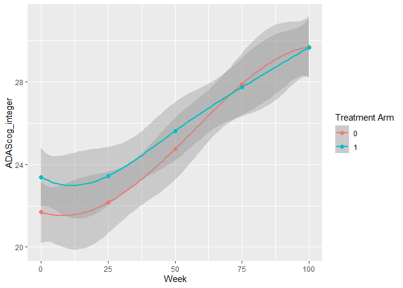

# TCT

<!-- badges: start -->

[](https://github.com/florianstijven/TCT/actions/workflows/R-CMD-check.yaml)
[](https://lifecycle.r-lib.org/articles/stages.html#experimental)
[](https://codecov.io/gh/florianstijven/TCT)
<!-- badges: end -->

The goal the TCT package is to provide a set of easy to use functions to
perform time components test.

## Installation

You can install the development version of TCT from
[GitHub](https://github.com/) with:

``` r
# install.packages("devtools")
devtools::install_github("florianstijven/TCT")
```

## Example

This is a basic example which shows you how to use the Meta-TCT
methodology in combination with an estimated MMRM model. These are
simulated data and are available as `simulated_test_trial` from the
`TCT` package. We first explore the data set graphically.

``` r
library(ggplot2)
library(TCT)
library(dplyr)
```

    ## 
    ## Attaching package: 'dplyr'

    ## The following objects are masked from 'package:stats':
    ## 
    ##     filter, lag

    ## The following objects are masked from 'package:base':
    ## 
    ##     intersect, setdiff, setequal, union

``` r
simulated_test_trial %>%
  ggplot(aes(x = Week, y = ADAScog_integer, color = as.factor(arm))) +
  # geom_jitter(width = 1, alpha = 0.1) +
  geom_smooth(method = "lm",
              formula = y ~ splines::bs(x = x,
                                        intercept = FALSE, 
                                        df = 4)
              ) + 
  geom_point(
    data = simulated_test_trial %>%
      group_by(Week, arm) %>%
      summarize(mean = mean(ADAScog_integer)),
    aes(x = Week, y = mean, color = as.factor(arm)),
    size = 2
  ) +
  scale_color_discrete(name = "Treatment Arm")
```

    ## `summarise()` has grouped output by 'Week'. You can override using the
    ## `.groups` argument.

<!-- -->

The first step in a meta TCT analysis is to estimate a longitudinal
model. We fit a mixed model for repeated measures (MMRM) next, but other
models could be used as well. There are only two requirements for such
longitudinal models:

1.  The models returns an estimate of the mean (or median, quantile
    etc.) at each treatment-time combination, except for the baseline
    measurement occasion. For this occasion, we can assume a common
    parameter for both treatment groups. In what follows, we will always
    refer to these parameters as means.
2.  The sampling distribution of the estimator is (asymptotically)
    multivariate normal.

All we need from the estimated longitudinal model is the estimated mean
vector and the estimated variance-covariance matrix for this estimated
vector.

``` r
# Example data set transformed to format required by TCT_meta()
data_test = simulated_test_trial %>%
  mutate(
    time_int = (Week %/% 25) + 1,
    arm_time = ifelse(time_int == 1L,
                      "baseline",
                      paste0(arm, ":", time_int)),
    SubjId = as.factor(SubjId),
    time_int = as.factor(time_int)
  )
# Fit a MMRM model to the data set. The parameter estimates of this model form
# the basis to perform the meta time component tests. We do not include an
# intercept such that the model's mean parameters correspond to the
# time-specific means.
mmrm_fit = mmrm::mmrm(
  formula = ADAScog_integer ~ arm_time - 1 + us(time_int | SubjId),
  data = data_test,
  reml = TRUE
)
```

After fitting a MMRM model, we can use the `TCT_meta()` function to
perform the time-component test. The first step is to estimate the
acceleration factor for each time point. Different approaches for
inference are available. Note that the estimators in these different
approaches are equivalent, but the corresponding measures of uncertainty
are not equivalent. Information on these approaches can be found in the
function documentation.

In the following output, a table is printed with the following
information:

- `Value`: The estimated time-specific acceleration factor.
- `Std. Error`: The estimated standard error for the estimated
  time-specific acceleration factor.
- `z value`: Z statistic for the score test because we selected
  `inference = "score"`.
- `p value`: p-value based on the Z statistic.
- `CI`: 95% confidence interval based on the score test.
- `CI (bootstrap)`: 95% confidence interval based on the parametric
  bootstrap based on `B = 1e4` bootstrap replications.

``` r
# TCT_meta() is the main function for performing time component tests. The estimated
# mean parameters of the MMRM model and associated variance-covariance matrix
# form the basis for the time component test.
TCT_fit = TCT_meta(
  time_points = 0:4,
  ctrl_estimates = coef(mmrm_fit)[c(9, 1:4)],
  exp_estimates = coef(mmrm_fit)[5:8],
  vcov = vcov(mmrm_fit)[c(9, 1:4, 5:8), c(9, 1:4, 5:8)],
  interpolation = "spline",
  inference = "score",
  B = 1e4
)
# Summary of the results of the time component test. Here we have estimated a
# treatment effect parameter on the time scale for every measurement occasion.
summary(TCT_fit)
```

    ## Meta-Time Component Test: 
    ## 
    ## Coefficients: 
    ##               Value Std. Error  z value  p value                  CI
    ## arm_time1:2 0.73273   0.621669 -0.59459 0.552115 (-0.28765, 1.35489)
    ## arm_time1:3 0.87347   0.101820 -1.23650 0.216274 ( 0.66357, 1.07518)
    ## arm_time1:4 0.79370   0.080569 -2.12583 0.033517 ( 0.64340, 0.97939)
    ## arm_time1:5 0.75102   0.096777 -1.71596 0.086170 ( 0.60151, 1.03733)
    ##                  CI (bootstrap)
    ## arm_time1:2 (-0.29139, 1.34050)
    ## arm_time1:3 ( 0.66738, 1.07357)
    ## arm_time1:4 ( 0.64450, 0.97287)
    ## arm_time1:5 ( 0.60398, 1.02675)
    ## alpha = 0.05
    ## 
    ## Interpolation Method: spline
    ## Estimation and Inference: score

The next step is to estimate a common acceleration factor. As before,
different approaches to inference are available. However, the estimators
in these different approaches are no longer equivalent. In the next code
chunk, the score-based weighted estimator with adaptively selected
weights is illustrated. This estimator weights the different measurement
occasions so that the variance of the corresponding estimator is
minimized.

``` r
# The object returned by TCT_meta() can be used as argument to the TCT_common() function.
# This function estimates a single common acceleration factor.
TCT_common_fit = TCT_meta_common(TCT_fit,
                                 B = 0,
                                 inference = "score",
                                 type = "custom")
summary(TCT_common_fit)
```

    ## Meta-Time Component Test - Common Acceleration Factor:
    ## 
    ## Estimated Common Acceleration Factor: 
    ##   Estimate Std. Error z value  p value                CI
    ## z   0.7937  0.0064913 -2.1258 0.033517 (0.6434, 0.97939)
    ## alpha = 0.05
    ## 
    ## Interpolation Method: spline
    ## Time Points Used in Estimator: 1 2 3 4
    ## Estimation and Inference: score
    ##  Type of Score Test: custom
    ##  Weights: 0 0 1 0
    ## 
    ## Test for proportional slowing factor (at the selected time points):
    ##  Df  Chisq p.value
    ##   3 3.4122 0.33233

The output shown above indicates that the optimal weights put all weight
on the third measurement occasion. Alternatively, one could set
`inference = "omnibus"`. The corresponding estimator is still
score-based, but uses a different weighting strategy. The p-value for
this estimator is consistent with the results from “classical”
hypothesis tests for $H_0: \alpha_j = \beta_j \;
\forall \; j$ where $\alpha_j$ and $\beta_j$ are the mean outcomes at
$t_j$ in the control and treatment group, respectively. This estimator
is an attractive complement to the classical hypothesis tests as the
corresponding confidence interval provides a very easy to interpret
quantification of the treatment effect. The analysis is repeated below
with this alternative estimator. Note that the standard error is `NA`
because a corresponding estimator has not yet been implemented.

``` r
TCT_common_fit = TCT_meta_common(TCT_fit,
                                 B = 0,
                                 inference = "score",
                                 type = "omnibus")
summary(TCT_common_fit)
```

    ## Meta-Time Component Test - Common Acceleration Factor:
    ## 
    ## Estimated Common Acceleration Factor: 
    ##             Estimate Std. Error chi-squared p value                CI
    ## chi-squared  0.85504         NA      6.2391 0.18199 (0.66416, 1.0855)
    ## alpha = 0.05
    ## 
    ## Interpolation Method: spline
    ## Time Points Used in Estimator: 1 2 3 4
    ## Estimation and Inference: score
    ##  Type of Score Test: omnibus
    ## 
    ## Test for proportional slowing factor (at the selected time points):
    ##  Df  Chisq p.value
    ##   3 3.4122 0.33233

We show that the p-value above is identical to the one obtained with a
classical hypothesis test if we use the asymptotic chi-squared
distribution instead of the F-distribution with approximate degrees of
freedom.

``` r
# Specify contrast matrix. 
contrast_matrix = matrix(c(-1, 0, 0, 0, 1, 0, 0, 0, 0,
                           0, -1, 0, 0, 0, 1, 0, 0, 0,
                           0, 0, -1, 0, 0, 0, 1, 0, 0,
                           0, 0, 0, -1, 0, 0, 0, 1, 0), nrow = 4, byrow = TRUE)
# Test for the linear contrast that corresponds to equal means in both treatment
# groups at the corresponding measurement occasions.
classical_test = mmrm::df_md(mmrm_fit,
                             contrast_matrix)
# Extract F-statistic for the linear contrast. This statistic follows
# asymptotically a chi-squared distribution if multiplied by the degrees of
# freedom. However, finite sample corrections are usually applied.
test_statistic = 4 * classical_test$f_stat
# Compute p-value using chi-squared distribution. This p-value is identical to the
# one obtained with TCT_meta_common() in the previous code chunk.
1 - stats::pchisq(test_statistic, 4)
```

    ## [1] 0.1819881

Finally, we show the results for the non-linear generalized least
squares (NL-GLS) estimator. In simulations, this estimator performs best
and should therefore be generally preferred.

``` r
TCT_common_fit = TCT_meta_common(TCT_fit,
                                 B = 0,
                                 inference = "least-squares")
summary(TCT_common_fit)
```

    ## Meta-Time Component Test - Common Acceleration Factor:
    ## 
    ## Estimated Common Acceleration Factor: 
    ##             Estimate Std. Error chi-squared  p value                CI
    ## chi-squared  0.85504   0.080211      2.8269 0.092696 (0.70072, 1.0285)
    ## alpha = 0.05
    ## 
    ## Interpolation Method: spline
    ## Time Points Used in Estimator: 1 2 3 4
    ## Estimation and Inference: least-squares
    ## 
    ## Test for proportional slowing factor (at the selected time points):
    ##  Df  Chisq p.value
    ##   3 3.4122 0.33233
